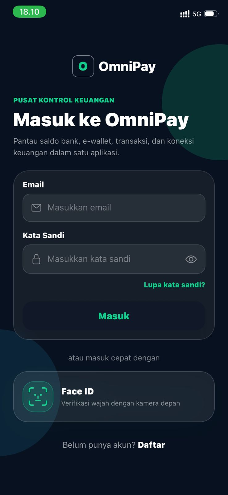
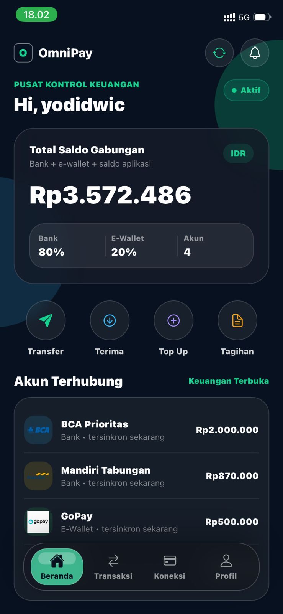
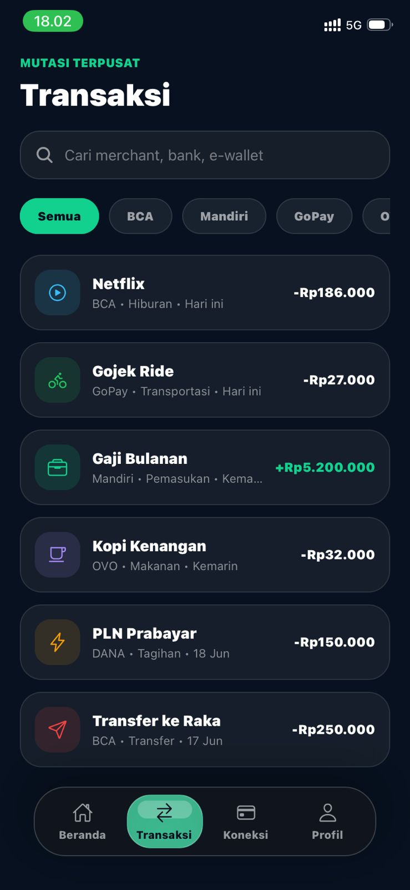
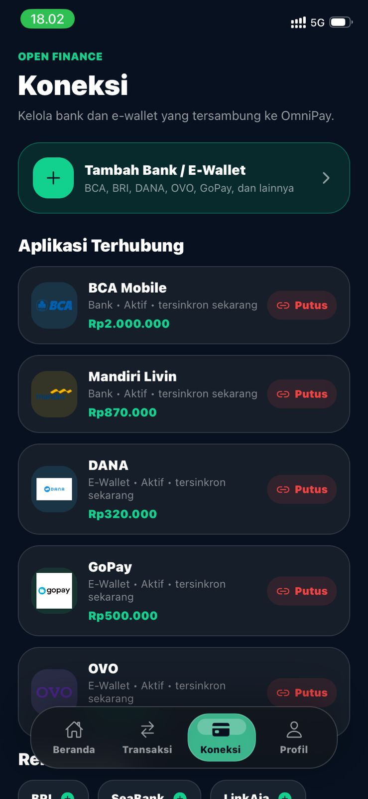

# OmniPay

OmniPay adalah aplikasi pusat kontrol keuangan berbasis React Native (Expo) untuk memantau saldo, koneksi bank, e-wallet, transaksi, dan keamanan akun dalam satu layar modern. UI dibuat dengan tema gelap premium, efek glass blur, bottom navigation liquid, dan pengalaman Face ID berbasis kamera depan.

## Menjalankan

```bash
cd omnipay
npm install
npx expo start
```

Scan QR dengan **Expo Go** di Android/iOS, atau tekan `a` / `i` untuk emulator.

## 📱 Tampilan Aplikasi

<div align="center">





</div>

<div align="center">




</div>


## Fitur Utama

- **Login & Daftar Akun** - masuk dengan email/password, daftar akun baru, dan reset password.
- **Face ID Dengan Sensor Truedepth Apple IPhone** - pengguna bisa mendaftarkan wajah lewat pengaturan akun atau mendaftarkan wajah saat akun dibuat.
- **Ketahanan Keamanan Lebih Tinggi** - Face ID menggabungkan biometrik 3D dengan Sensor truedepth dan Dot Projector milik Apple iphone, membandingkan wajah saat login, dan tidak bergantung pada akses orang lain hanya dari tombol masuk biasa.
- **Dashboard Agregator Keuangan** - total saldo gabungan dari bank, e-wallet, dan saldo aplikasi tampil dalam satu ringkasan.
- **Akun Terhubung** - menampilkan koneksi BCA, Mandiri, GoPay, OVO, DANA, dan e-wallet/bank lain.
- **Transaksi Terpusat** - riwayat transaksi dari bank/e-wallet bisa dicari dan difilter berdasarkan sumber seperti BCA, Mandiri, GoPay, OVO, dan DANA.
- **Aksi Cepat** - Transfer, Terima, Top Up, dan Tagihan langsung memperbarui saldo serta riwayat.
- **Insight Omni AI** - panel insight untuk pengingat tagihan dan ringkasan kondisi saldo.
- **Profil & Pengaturan** - kelola keamanan, notifikasi push/email, mode gelap, bantuan, dan logout.
- **Navigasi Liquid Glass** - bottom navigation blur dengan pilihan menu yang bisa ditap maupun digeser.
- **Penyimpanan Lokal** - data sesi, akun, saldo, transaksi, dan pengaturan disimpan menggunakan AsyncStorage.

## Catatan Keamanan Face ID

Face ID di OmniPay adalah simulasi biometrik berbasis kamera depan Dengan Sensor **Truedepth**, Jika login di perangkat Apple. Di android Mungkin berfungsi tetapi hanya keamanan kamera biasa. Tolong dipahami
